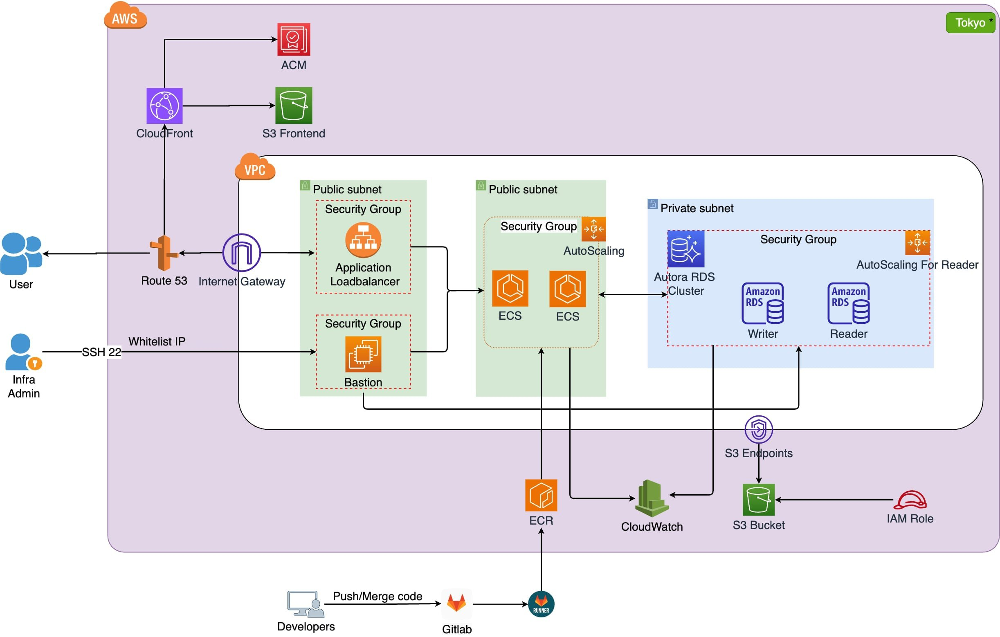
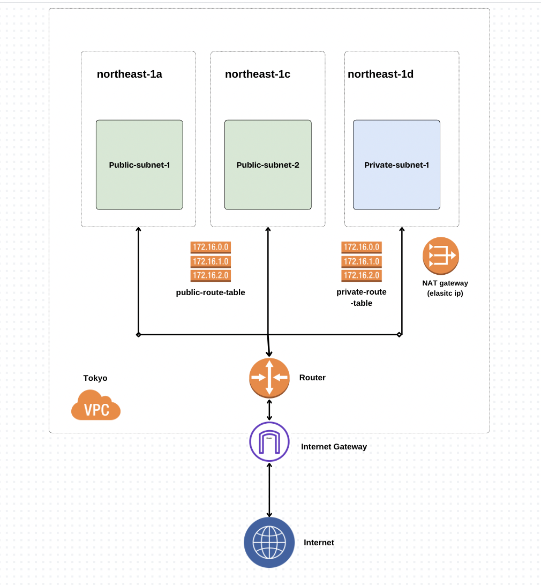
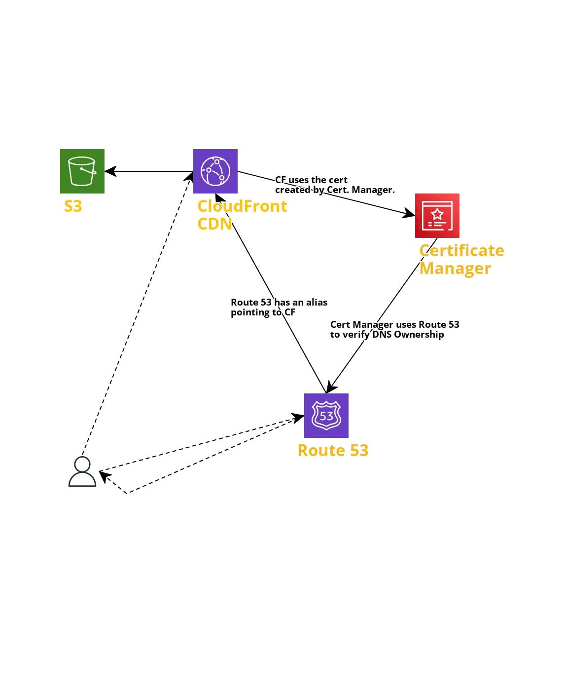
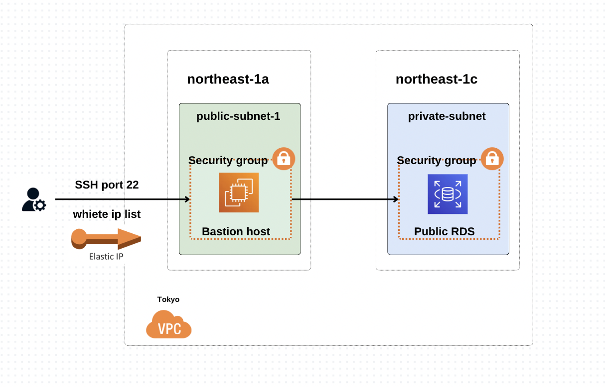
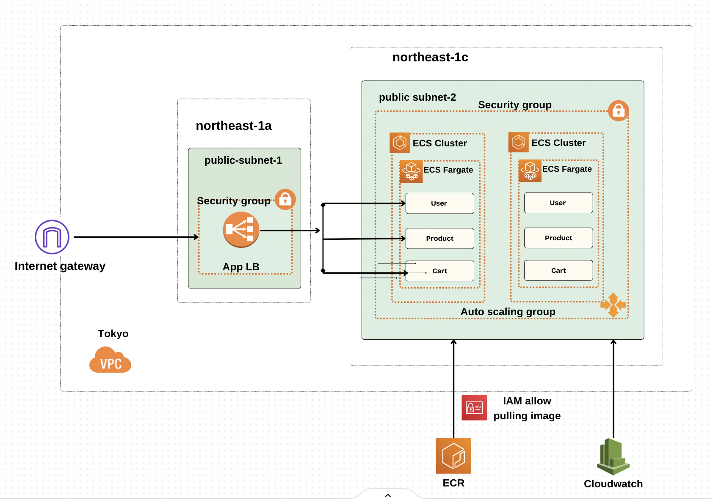
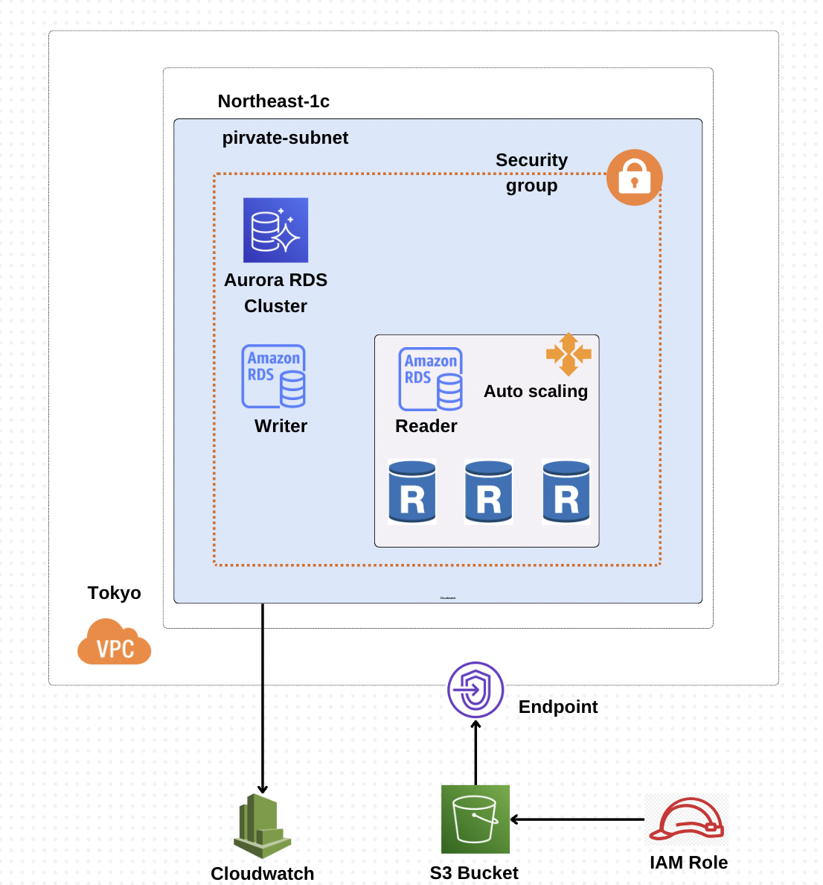
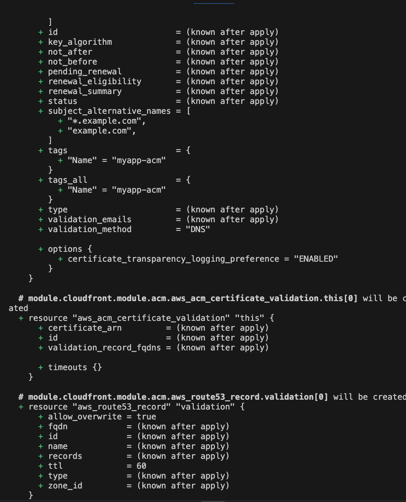

# Create infrastructure using Terraform

Create the infrastructure was described by this diagram


## Create VPC

- VPC: ap-norheast-1 (Tokyo)
- 3 subnets: 2 public, 1 private
- Route table
- NAT gateway with Elastic IP
- Internet gateway

### Architecture Overview



## Create S3 Cloudfront Website

- S3: store frontend web files
- Cloudfront: content delivery network (CDN) that speeds up the delivery of static and dynamic content
- ACM: AWS Certificate Manager is a service that simplifies the process of obtaining, managing, and deploying Secure Sockets Layer/Transport Layer Security (SSL/TLS) certificates
- Route53: a scalable and highly available Domain Name System (DNS) web service

### Architecture Overview



## Create Bastion Host

- Bastion Host
- Security group for ssh port 22 and white list ip
- Elastic IP for Bastion Host

### Architecture Overview



## Create ECS Cluster with App Load Balancer

- ECR: Elastic Container Registry for store image
- ECS: Elastic Container Service is a fully managed container orchestration service
- IAM policy for ECS permissions to pull image from the ECR
- App Load Balanacer
- Auto Scalling
- Cloud Watch: metrics method for repository
- Security group for ECS and App Load Balancer

### Architecture Overview



## Create RDS cluster

- Aurora RDS Cluster
- RDS instace Writer
- RDS instance Reader with autoscalling
- S3 Bucket for importing data
- IAM policy for Aurora RDS permissions to access the S3 bucket
- Security group for RDS
- Cloud Watch: metrics method for RDS db cluster

### Architecture Overview



## How to run

- clone `git clone https://github.com/chikaharo/infrastructure-terraform-2.git`
- cd to repo folder `cd infrastructure-terraform-2`
- Init terraform `terraform init`
- Export your AWS configuration by run this command in terminal:

```
export AWS_ACCESS_KEY_ID=YOUR_AWS_ACCESS_KEY_ID
export AWS_SECRET_ACCESS_KEY=YOUR_AWS_SECRET_ACCESS_KEY
```

- Generate ssh key pair for bastion host

```
ssh-keygen -t rsa -C "you.email@example.com" -b 4096
chmod 600 path-to-repo/secrets/ec2-bastion-key-pair
```

It will prompt you to enter the complete path to the file in which to save the key enter the path e.g path-to-repo/secrets/ec2-bastion-key-pair

- Plan `terraform plan`
- Create infrastructure `terraform apply`
  
- Destroy infrastructure `terraform apply -destroy`
