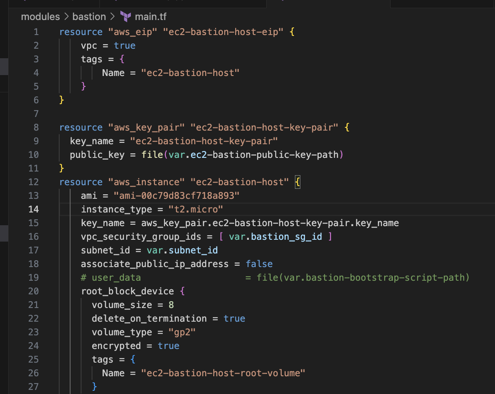
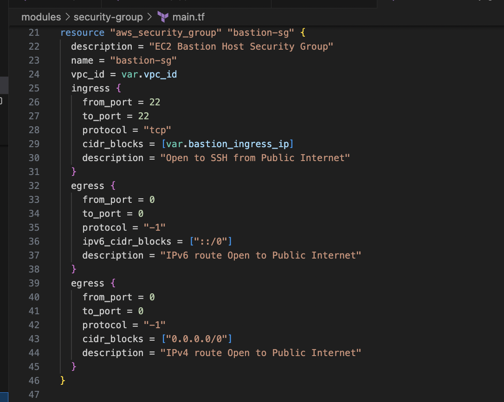
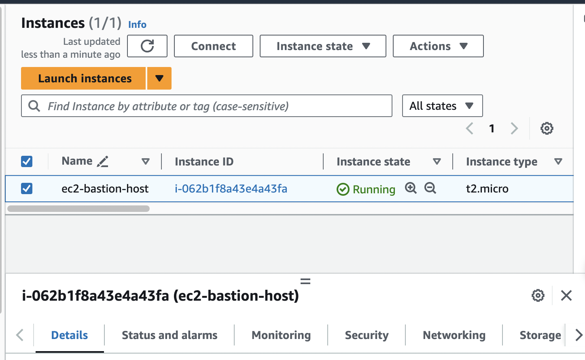

# Infrastructure using Terraform

## Create VPC

- VPC: ap-norheast-1 (Tokyo)
- 3 subnets: 2 public, 1 private
- Route table
- NAT gateway with Elastic IP
- Internet gateway
  

## Create Bastion Host

### Generating SSH Key Pair

First we need to create the SSH Key Pair using following command:
`ssh-keygen -t rsa -C "you.email@example.com" -b 4096`
`chmod 600 path-to-repo/terraform-iac/aws/infrastructure/secrets/ec2-bastion-key-pair`

### Create ec2 instance for bastion host and elastic IP

### Security group to allow ssh port 22 from infra admin

### Bastion host ready

